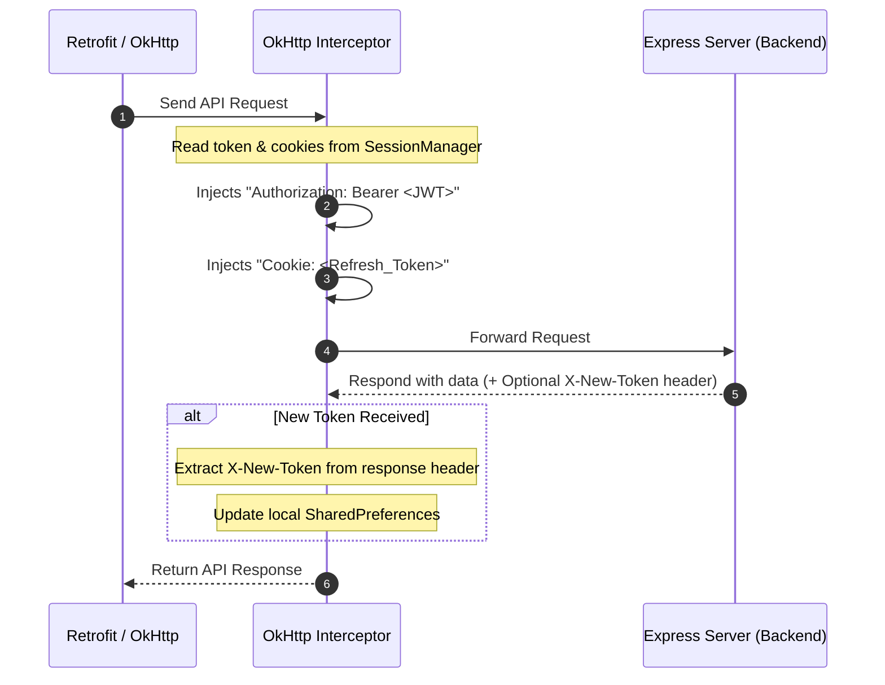

# 🚀 XLMS

<div align="center">
  

<h3><b>XLMS Library Management System</b></h3>
  <p>
    A full-stack library management system for administrators, borrowers, notifications, email verification, and inventory tracking.
  </p>

<p>
    
    
    
    
    
  </p>
</div>

---

## 📌 Overview

**XLMS Library Management System** is a full-stack solution designed to simplify library operations across web services and Android devices.

It combines:

- ⚙️ A **Node.js + Express** backend with Microsoft SQL Server
- 📱 A **native Android application** using modern AndroidX libraries
- 🔐 Secure authentication, notifications, and automation workflows

---

## 💡 Why this project is useful

XLMS helps streamline library operations with:

- Centralized book and user management
- Secure authentication with JWT
- OTP email verification and automated notifications
- Real-time Android synchronization with backend APIs
- Inventory and borrowing lifecycle tracking

---

## ✨ Key Features

- 📚 **Dual-Role Dashboards**: Tabbed panels for Admin actions and Client checkouts/reservations.
- 🔒 **Secure Authorization**: Multi-tiered JWT authentication with automatic access token renewal.
- 🌐 **OkHttp Interceptor Pipeline**: Transparent header authorization, persistent cookie sessions, and silent token updates.
- 📩 **OTP Email Verification**: Multi-step user self-registration and password resets verified via SMTP.
- 🔄 **Lending Lifecycle**: Automated copy inventory decrementing/incrementing and FIFO reservation queues.
- 📶 **Offline Resilience**: Instant redirection to a network recovery screen on connection timeout/errors.
- 🎨 **Rich Aesthetics**: Programmatically drawn bar charts, native availability pie charts, and skeleton loading shimmers.
- 📊 **Modular MVC Design**: Clean, structured backend controllers with Microsoft SQL Server integration.

---

## 🔒 Session Management & Network Interceptor

The Android client relies on a high-performance **OkHttp Interceptor pipeline** configured inside [ApiClient.java](file:///C:/Android%20App%20Project/XLMS/FrontEnd/app/src/main/java/com/xlms/librarymanagement/api/ApiClient.java) to handle session management, JWT authorization, and network failure handling transparently.



### 1. Transparent Header Injection
The interceptor queries the [SessionManager](file:///C:/Android%20App%20Project/XLMS/FrontEnd/app/src/main/java/com/xlms/librarymanagement/utils/SessionManager.java) on every outgoing request:
* If a short-lived **Access Token (JWT)** is present, it is dynamically appended to the request header as:
  ```http
  Authorization: Bearer <Access_Token>
  ```
* Any stored session cookies containing the long-lived **Refresh Token** are automatically formatted and attached to the request:
  ```http
  Cookie: refreshToken=<Refresh_Token>
  ```

### 2. Silent JWT Auto-Refresh (`X-New-Token`)
To prevent interrupting the user experience when a JWT expires:
* If the server detects that the access token is expired (or near expiration within 5 minutes) but the refresh cookie is valid, it generates a new JWT and includes it in the `X-New-Token` response header.
* The interceptor reads this header from the incoming response, saves the new access token to the local `SharedPreferences` session, and applies it to all future network calls.

### 3. Graceful Offline Handling
If a network error or connection timeout throws an `IOException` during a request, the interceptor intercepts the failure, builds a new Intent, and instantly boots the [NoInternetActivity](file:///C:/Android%20App%20Project/XLMS/FrontEnd/app/src/main/java/com/xlms/librarymanagement/ui/error/NoInternetActivity.java) screen to inform the user, ensuring the app remains crash-free.

---

## ⚡ Tech Stack

| Tech | Details |
|------|--------|
|  | Node.js • Express.js • mssql • JWT • Bcrypt • Gmail API |
|  | Android Studio • AndroidX • Retrofit • OkHttp • Gson • Shimmer |
|  | Microsoft SQL Server (Hosted on Somee.com) |
|  | GitHub Actions (`android_release.yml`) |

---

## 📁 Repository Structure

```
XLMS/
├── BackEnd/                    # Node.js REST API
│   ├── controller/             # Business logic (auth, books, users, lenders, mail, etc.)
│   ├── middleware/             # JWT auth + auto-refresh middleware (app.js)
│   ├── models/                 # SQL Server connection pool (db.js)
│   ├── routes/                 # Express route definitions
│   └── server.js               # Entry point, CORS, route mounts
├── FrontEnd/                   # Android application (Java)
│   ├── app/src/main/java/com/xlms/librarymanagement/
│   │   ├── SplashActivity.java
│   │   ├── api/                # Retrofit client, request/response models
│   │   ├── model/              # POJOs (Book, Member, Notification, etc.)
│   │   ├── adapter/            # RecyclerView adapters
│   │   ├── utils/              # SessionManager, repositories
│   │   └── ui/                 # Screen fragments
│   │       ├── admin/          # Admin dashboard tabs & detail screens
│   │       ├── client/         # Client dashboard tabs & detail screens
│   │       ├── auth/
│   │       ├── components/     # Custom charts (PieChartView, StackedAreaChartView)
│   │       ├── login/
│   │       ├── signup/
│   │       └── error/
│   └── build.gradle.kts
├── UI Design/                  # UI mockups and HTML prototypes
│   └── screens/                # 46 screen design files
├── .github/workflows/          # CI/CD pipeline
│   └── android_release.yml     # Automated APK build & GitHub Release
├── overview.md                 # System overview
├── features.md                 # Feature breakdown (backend + frontend)
├── api.md                      # Full API reference with endpoints
├── architecture.md             # Backend & frontend architecture details
├── app-flows.md                # Application flow diagrams (Mermaid)
├── ui.md                       # UI screen hierarchy & design language
├── PRD.md                      # Product Requirements Document
├── TRD.md                      # Technical Requirements Document
└── README.md
```

---

## 🛠️ Getting Started

### Prerequisites

- Node.js 18+
- npm
- Android Studio
- Microsoft SQL Server
- Gmail API credentials (optional)

---

### Backend Setup

```bash
cd BackEnd
npm install
```

Create `.env` file:

```env
user=YOUR_DB_USER
DB_PASS=YOUR_DB_PASSWORD
server=YOUR_DB_SERVER
database=YOUR_DB_NAME
URL=http://localhost:3000
JWT=your_jwt_secret
GOOGLE_CLIENT_ID=your_google_client_id
GOOGLE_CLIENT_SECRET=your_google_client_secret
GOOGLE_REDIRECT_URI=https://developers.google.com/oauthplayground
GOOGLE_REFRESH_TOKEN=your_google_refresh_token
GOOGLE_USER_EMAIL=your-email@example.com
```

Run server:

```bash
npm start
# or
npm run dev
```

---

### Android Setup

```bash
cd FrontEnd
```

* Open in Android Studio
* Sync Gradle

Run:

```bash
./gradlew assembleDebug -PBASE_URL="http://localhost:3000/"
```

> **Note:** Omit the `-PBASE_URL` flag to use the default hosted API endpoint.

---

## 🚀 Example Usage

* API Base: `http://localhost:3000/api`
* Android login & registration with OTP email verification
* Admin dashboard with book/user/lender management
* Client dashboard with catalog browsing, checkout & reservations
* Real-time borrowing & return workflow with reservation queue

---

## 📚 Documentation

| Document | Description |
|----------|-------------|
| `overview.md` | System overview & integration status |
| `features.md` | Full feature breakdown (backend + frontend) |
| `api.md` | Complete API reference with request/response examples |
| `architecture.md` | Backend & frontend architecture details |
| `app-flows.md` | Sequence diagrams for all major workflows |
| `ui.md` | Screen hierarchy, design language & layout inventory |
| `PRD.md` | Product Requirements Document |
| `TRD.md` | Technical Requirements Document |
| `UI Design/` | HTML mockups for all 46 app screens |
| `BackEnd/server.js` | Backend entry point |

---

## 🤝 Contributing

* Fork repository
* Create feature branch
* Submit pull request to `main`
* Follow clean code structure

---

## 📄 License

This project is open-source for learning and academic use.
