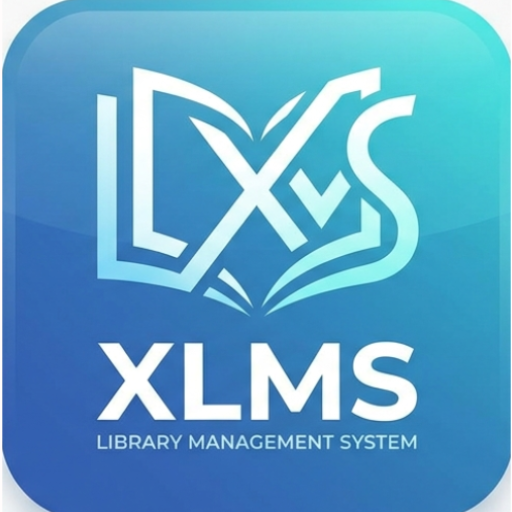

# 🚀 XLMS

<div align="center">
  

<h3><b>XLMS Library Management System</b></h3>
  <p>
    A full-stack library management system for administrators, borrowers, notifications, email verification, and inventory tracking.
  </p>

<p>
    
    
    
    
    
  </p>
</div>

---

## 📌 Overview

**XLMS Library Management System** is a full-stack solution designed to simplify library operations across web services and Android devices.

It combines:

- ⚙️ A **Node.js + Express** backend with Microsoft SQL Server
- 📱 A **native Android application** using modern AndroidX libraries
- 🔐 Secure authentication, notifications, and automation workflows

---

## 💡 Why this project is useful

XLMS helps streamline library operations with:

- Centralized book and user management
- Secure authentication with JWT
- OTP email verification and automated notifications
- Real-time Android synchronization with backend APIs
- Inventory and borrowing lifecycle tracking

---

## ✨ Key Features

- 📚 Admin dashboard for books, users, reservations, and inventory
- 🔐 JWT authentication with refresh token support
- 📩 Email OTP verification via Gmail API
- 🔄 Book lending lifecycle tracking system
- 👥 Role-based access control (Admin / User)
- 📱 Android app with Retrofit + OkHttp integration
- 🎨 Smooth UI with Shimmer loading effects
- 📊 Modular backend architecture (MVC pattern)

---

## ⚡ Tech Stack

| Tech | Details |
|------|--------|
|  | Node.js • Express.js • mssql • JWT • Bcrypt • Gmail API |
|  | Android Studio • AndroidX • Retrofit • OkHttp • Gson • Shimmer |
|  | Microsoft SQL Server |
|  | GitHub Actions (`android_release.yml`) |                      |                   |

---

## 📁 Repository Structure

```

XLMS/
├── BackEnd/                 # Node.js backend (REST API)
│   ├── controller/
│   ├── middleware/
│   ├── models/
│   ├── routes/
│   └── server.js
├── FrontEnd/               # Android application
│   ├── app/
│   └── build.gradle.kts
├── UI Design/              # UI mockups and prototypes
└── context/                # Documentation and feature specs

```

---

## 🛠️ Getting Started

### Prerequisites

- Node.js 18+
- npm
- Android Studio
- Microsoft SQL Server
- Gmail API credentials (optional)

---

### Backend Setup

```bash
cd BackEnd
npm install
```

Create `.env` file:

```env
PORT=5000
URL=http://localhost:5000
user=YOUR_DB_USER
DB_PASS=YOUR_DB_PASSWORD
server=YOUR_DB_SERVER
database=YOUR_DB_NAME
JWT=your_jwt_secret
JWT_REFRESH=your_jwt_refresh_secret
GOOGLE_CLIENT_ID=...
GOOGLE_CLIENT_SECRET=...
GOOGLE_REDIRECT_URI=https://developers.google.com/oauthplayground
GOOGLE_REFRESH_TOKEN=...
GOOGLE_USER_EMAIL=your-email@example.com
```

Run server:

```bash
npm start
# or
npm run dev
```

---

### Android Setup

```bash
cd FrontEnd
```

* Open in Android Studio
* Sync Gradle
* Set backend URL in `gradle.properties`

Run:

```bash
./gradlew assembleDebug -PBASE_URL="http://localhost:5000/"
```

---

## 🚀 Example Usage

* API Base: `http://localhost:5000/api`
* Android login & registration
* Admin book/user management
* Email OTP verification system
* Real-time borrowing workflow

---

## 📚 Documentation

* `context/overview.md` → System overview
* `context/features.md` → Feature breakdown
* `UI Design/` → UI screens
* `BackEnd/server.js` → Entry point

---

## 🤝 Contributing

* Fork repository
* Create feature branch
* Submit pull request to `main`
* Follow clean code structure

---

## 📄 License

This project is open-source for learning and academic use.
