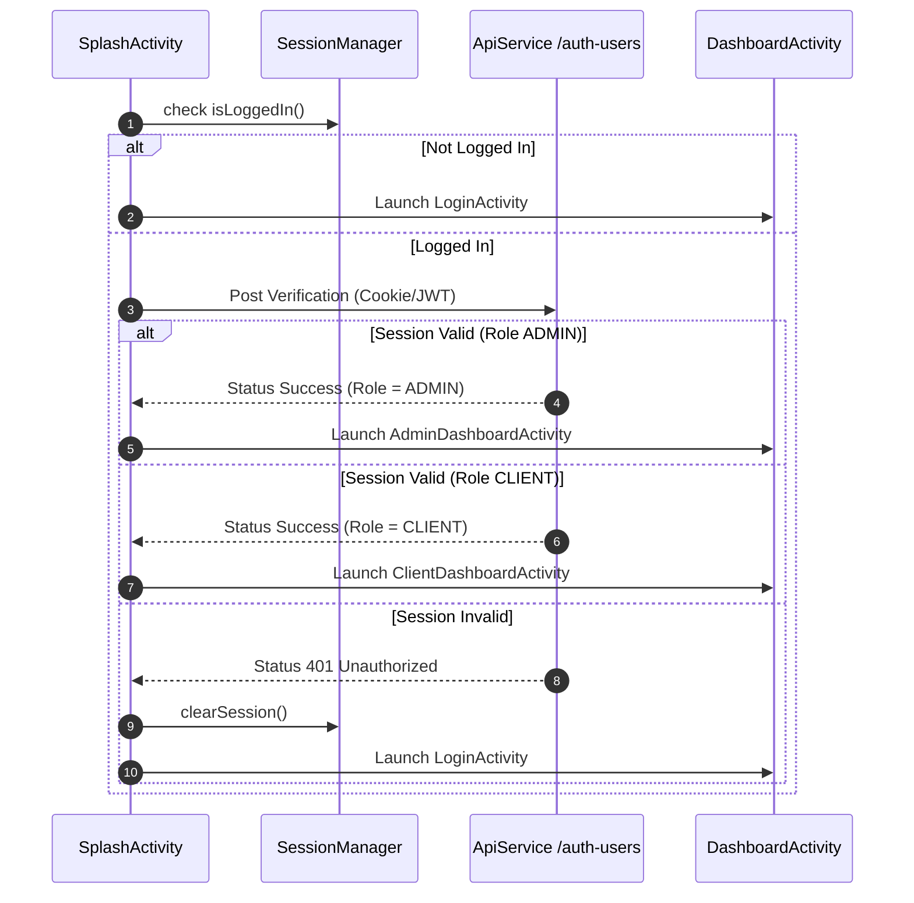
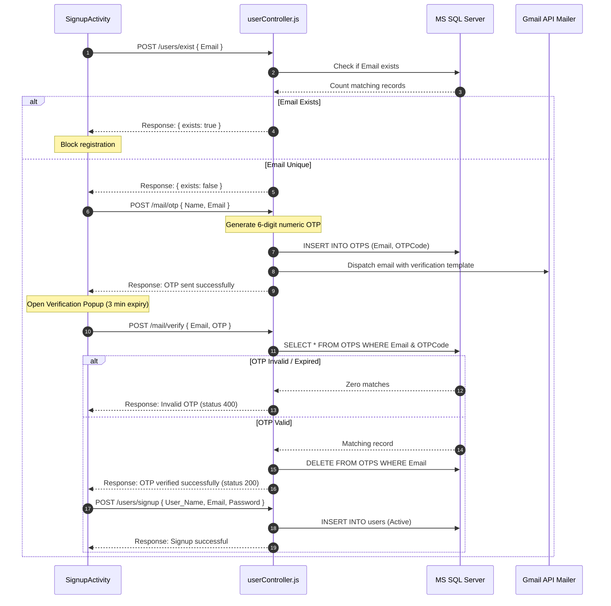
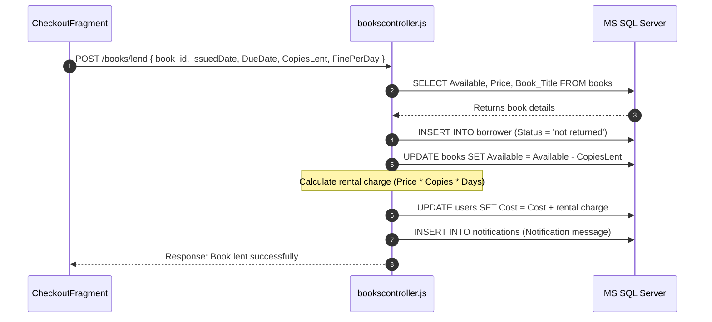
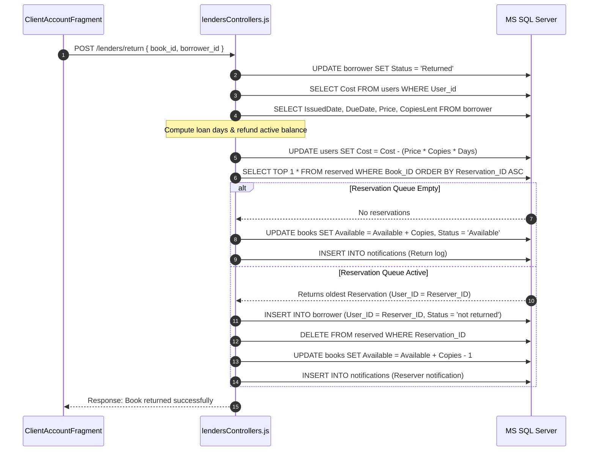
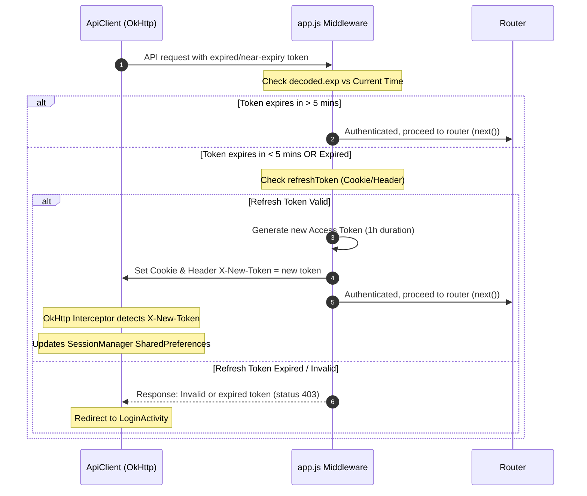

# Application Flows Spec

This document details the critical sequence flows, client-server API contracts, and database modifications across all main features of the XLMS application.

---

## 1. Authentication & Session Routing Flow
Determines user session states during launch and routes users to the corresponding portal interface.

---

## 2. Member Signup & OTP Verification Flow
Enforces email validation before allowing users to register as Clients.

---

## 3. Book Rental/Lending Flows

### 3.1. Client Self-Checkout
Allows users to borrow items directly from the catalog.

### 3.2. Admin Manual Lending
Enables administrators to assign books to users (creating guest accounts if necessary).
- Admin posts payload to `/api/lenders/insert`.
- Backend checks if user exists in database by email:
  - **New User**: Auto-generates a `User_id`, hashes a secure default password, registers user as "Active", and calculates lending charges. Dispatches account credentials and verification links via SMTP.
  - **Existing User**: Retrieves `User_id`, checks if account is "Active", and updates their cost balance.
- Backend decrements book availability stock and saves the loan log.

---

## 4. Book Return & Reservation Allocation Flow
Recalculates balances, checks pending reserves, and implements FIFO queue hand-offs.

---

## 5. Book Reservation Flow
Enables users to reserve currently checked-out materials.
1. Client selects out-of-stock item and submits a reserve request.
2. App sends a POST request to `/api/reservations/reserve` containing `{ book_id, reservation_date }`.
3. Backend processes the request:
   - Registers reservation entry: `INSERT INTO reserved (User_ID, Book_ID, Reserved_Date)`.
   - Modifies book status: `UPDATE books SET Status = 'Reserved' WHERE Book_ID = @Book_ID`.
   - Generates a confirmation notification: `INSERT INTO notifications`.
   - Sends a confirmation email to the client.

---

## 6. JWT Token Auto-Refresh Network Flow
Handles JWT validations and silent updates on the client.

