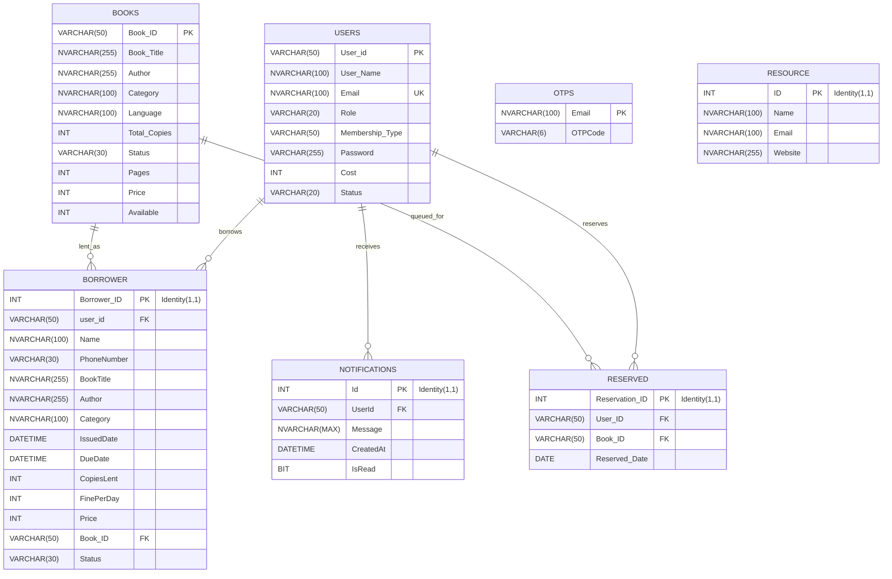

# XLMS Backend Database Schemas

This document details the MS SQL Server database schemas hosted on **Somee.com** for the XLMS Library Management System.

---

## 📊 Entity Relationship Diagram (ERD)



---

## 🗄️ Tables and Data Dictionaries

### 1. `users` Table
Stores records of registered library users (admins and clients).

```sql
CREATE TABLE users (
    User_id VARCHAR(50) PRIMARY KEY,
    User_Name NVARCHAR(100) NOT NULL,
    Email NVARCHAR(100) UNIQUE NOT NULL,
    Role VARCHAR(20) DEFAULT 'User', -- 'Admin', 'User'
    Membership_Type VARCHAR(50) DEFAULT 'English',
    Password VARCHAR(255) NOT NULL, -- bcrypt hashed
    Cost INT DEFAULT 0, -- accumulated active rental costs
    Status VARCHAR(20) DEFAULT 'Active' -- 'Active', 'Deactivated'
);
```

| Column Name | Data Type | Nullable / Default | Key / Constraint | Description |
|---|---|---|---|---|
| `User_id` | `VARCHAR(50)` | No | Primary Key | Unique user/student ID identifier. |
| `User_Name` | `NVARCHAR(100)` | No | - | Full name of the user. |
| `Email` | `NVARCHAR(100)` | No | Unique Key | Email address (used for logging in and notifications). |
| `Role` | `VARCHAR(20)` | Yes (Default `'User'`) | Check Constraint | Role of the user: `'Admin'` or `'User'`. |
| `Membership_Type` | `VARCHAR(50)` | Yes (Default `'English'`) | - | Selected membership tier. |
| `Password` | `VARCHAR(255)` | No | - | Securely hashed password (via `bcrypt`). |
| `Cost` | `INT` | Yes (Default `0`) | - | Aggregated unpaid balance / fine dues. |
| `Status` | `VARCHAR(20)` | Yes (Default `'Active'`) | - | Lifecycle state: `'Active'` or `'Deactivated'`. |

---

### 2. `books` Table
Maintains catalog info and inventory counts.

```sql
CREATE TABLE books (
    Book_ID VARCHAR(50) PRIMARY KEY,
    Book_Title NVARCHAR(255) NOT NULL,
    Author NVARCHAR(255) NOT NULL,
    Category NVARCHAR(100) NOT NULL,
    Language NVARCHAR(100) NOT NULL,
    Total_Copies INT NOT NULL,
    Status VARCHAR(30) NOT NULL, -- 'Available', 'Borrowed', 'Reserved', 'Out of stock'
    Pages INT NOT NULL,
    Price INT NOT NULL,
    Available INT NOT NULL -- current stock count on shelves
);
```

| Column Name | Data Type | Nullable / Default | Key / Constraint | Description |
|---|---|---|---|---|
| `Book_ID` | `VARCHAR(50)` | No | Primary Key | Unique catalog ISBN / barcode identifier. |
| `Book_Title` | `NVARCHAR(255)` | No | - | Title of the publication. |
| `Author` | `NVARCHAR(255)` | No | - | Name of the book's author. |
| `Category` | `NVARCHAR(100)` | No | - | Genre categorization (e.g. Science, Fiction). |
| `Language` | `NVARCHAR(100)` | No | - | Publishing language. |
| `Total_Copies` | `INT` | No | - | Cumulative copies owned by library. |
| `Status` | `VARCHAR(30)` | No | - | Status flag (e.g., `'Available'`, `'Out of stock'`). |
| `Pages` | `INT` | No | - | Total page count. |
| `Price` | `INT` | No | - | Rental base price / value of the copy. |
| `Available` | `INT` | No | - | Current inventory counts resting on shelves. |

---

### 3. `borrower` Table
Logs book loans and payment statuses.

```sql
CREATE TABLE borrower (
    Borrower_ID INT IDENTITY(1,1) PRIMARY KEY,
    user_id VARCHAR(50) FOREIGN KEY REFERENCES users(User_id),
    Name NVARCHAR(100) NOT NULL,
    PhoneNumber VARCHAR(30) NULL,
    BookTitle NVARCHAR(255) NOT NULL,
    Author NVARCHAR(255) NOT NULL,
    Category NVARCHAR(100) NOT NULL,
    IssuedDate DATETIME NOT NULL,
    DueDate DATETIME NOT NULL,
    CopiesLent INT NOT NULL DEFAULT 1,
    FinePerDay INT NOT NULL DEFAULT 0,
    Price INT NOT NULL,
    Book_ID VARCHAR(50) FOREIGN KEY REFERENCES books(Book_ID),
    Status VARCHAR(30) DEFAULT 'not returned' -- 'not returned', 'Returned'
);
```

| Column Name | Data Type | Nullable / Default | Key / Constraint | Description |
|---|---|---|---|---|
| `Borrower_ID` | `INT` | No (Identity) | Primary Key | Auto-incrementing record ID. |
| `user_id` | `VARCHAR(50)` | Yes | Foreign Key | References `users(User_id)`. |
| `Name` | `NVARCHAR(100)` | No | - | Cached borrower user name. |
| `PhoneNumber` | `VARCHAR(30)` | Yes | - | Contact phone number. |
| `BookTitle` | `NVARCHAR(255)` | No | - | Title of the issued book. |
| `Author` | `NVARCHAR(255)` | No | - | Author of the issued book. |
| `Category` | `NVARCHAR(100)` | No | - | Category of the issued book. |
| `IssuedDate` | `DATETIME` | No | - | Timestamp when book copy was issued. |
| `DueDate` | `DATETIME` | No | - | Lending expiration deadline date. |
| `CopiesLent` | `INT` | No (Default `1`) | - | Number of copies borrowed. |
| `FinePerDay` | `INT` | No (Default `0`) | - | Fine rate charged per overdue day. |
| `Price` | `INT` | No | - | Core cost of the book. |
| `Book_ID` | `VARCHAR(50)` | Yes | Foreign Key | References `books(Book_ID)`. |
| `Status` | `VARCHAR(30)` | Yes (Default `'not returned'`) | - | Lending status: `'not returned'` or `'Returned'`. |

---

### 4. `reserved` Table
Manages queues for currently checked-out materials.

```sql
CREATE TABLE reserved (
    Reservation_ID INT IDENTITY(1,1) PRIMARY KEY,
    User_ID VARCHAR(50) FOREIGN KEY REFERENCES users(User_id),
    Book_ID VARCHAR(50) FOREIGN KEY REFERENCES books(Book_ID),
    Reserved_Date DATE NOT NULL
);
```

| Column Name | Data Type | Nullable / Default | Key / Constraint | Description |
|---|---|---|---|---|
| `Reservation_ID` | `INT` | No (Identity) | Primary Key | Auto-incrementing reservation ID. |
| `User_ID` | `VARCHAR(50)` | Yes | Foreign Key | References `users(User_id)`. |
| `Book_ID` | `VARCHAR(50)` | Yes | Foreign Key | References `books(Book_ID)`. |
| `Reserved_Date` | `DATE` | No | - | Date when reservation queue entry was placed. |

---

### 5. `Notifications` Table
Tracks user-specific alerts and read receipts.

```sql
CREATE TABLE Notifications (
    Id INT IDENTITY(1,1) PRIMARY KEY,
    UserId VARCHAR(50) FOREIGN KEY REFERENCES users(User_id),
    Message NVARCHAR(MAX) NOT NULL,
    CreatedAt DATETIME NOT NULL,
    IsRead BIT DEFAULT 0
);
```

| Column Name | Data Type | Nullable / Default | Key / Constraint | Description |
|---|---|---|---|---|
| `Id` | `INT` | No (Identity) | Primary Key | Auto-incrementing notification record ID. |
| `UserId` | `VARCHAR(50)` | Yes | Foreign Key | References `users(User_id)`. |
| `Message` | `NVARCHAR(MAX)` | No | - | The notification alert text payload. |
| `CreatedAt` | `DATETIME` | No | - | Date and time when the alert was generated. |
| `IsRead` | `BIT` | Yes (Default `0`) | - | Read receipt flag (0 = unread, 1 = read). |

---

### 6. `OTPS` Table
Stores short-lived 6-digit verification codes for registration and password resets.

```sql
CREATE TABLE OTPS (
    Email NVARCHAR(100) PRIMARY KEY,
    OTPCode VARCHAR(6) NOT NULL
);
```

| Column Name | Data Type | Nullable / Default | Key / Constraint | Description |
|---|---|---|---|---|
| `Email` | `NVARCHAR(100)` | No | Primary Key | Target validation email address. |
| `OTPCode` | `VARCHAR(6)` | No | - | Generated 6-digit verification code. |

---

### 7. `Resource` Table
Stores links for external resources and third-party databases.

```sql
CREATE TABLE Resource (
    ID INT IDENTITY(1,1) PRIMARY KEY,
    Name NVARCHAR(100) NOT NULL,
    Email NVARCHAR(100) NOT NULL,
    Website NVARCHAR(255) NOT NULL
);
```

| Column Name | Data Type | Nullable / Default | Key / Constraint | Description |
|---|---|---|---|---|
| `ID` | `INT` | No (Identity) | Primary Key | Auto-incrementing resource identifier. |
| `Name` | `NVARCHAR(100)` | No | - | Name of the external database/library. |
| `Email` | `NVARCHAR(100)` | No | - | Support email of the resource. |
| `Website` | `NVARCHAR(255)` | No | - | URL link to access the website database. |
